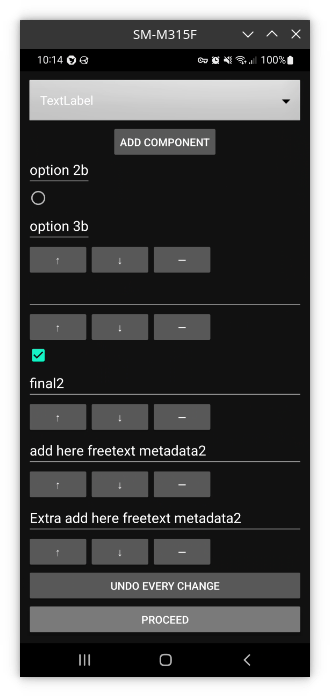
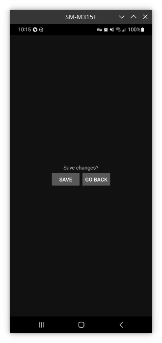

Usage
=====

.. _installation:

What does this strive to solve?
------------
Lab books are a type of log books traditionally used for taking notes during experiments. They have been used with success for centuries. Nowadays there is an increased need for electronic versions. Their information content is often part of the metadata that accompany the experiment. This content is often notes, screenshots, parameters but may also be photos. The LogbookPics App (LPA) aims at providing the latter; an easy yet advanced way to insert photos from a smartphone to a logbook. Such photos will be annotated but also accompanied with a suitable set of metadata.

Installation
------------

TODO: here there will be a download link to the project

How to use the app
------------

- The first thing you'll see once you open the app will be a QR Code scanner view

.. image:: ./imgs/qr_code_scanner.png

- Once you scan the QR Code and everything goes according to plan, you'll find yourself in front of a preview of the image that you're going to annotate

.. image:: ./imgs/image_preview.png

- Next, this is the Image Edit activity, in which you'll insert freehand drawing and text into your image

.. image:: ./imgs/image_edit.png

Next, this is the component system. Here you'll be able to add, remove and edit components. The components that are currently available are:

- TextLabel

- Bulleted List

- Radio

- Checkbox

But still, support for components might be added in the future.

.. image:: ./imgs/component_system.png

Next, you'll find yourself in the Save changes view. Here you'll be able to save changes or go back and scan a new image

.. note::
   The annotated image will also be saved in the Gallery if you specified so in the Settings

